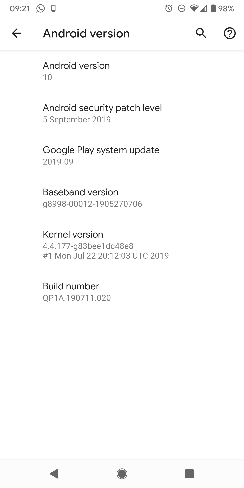

# ListPicker Test

This is a simple test to show an issue with the `ListPicker` control on the latest android update (`10`). This crashes on loading with the error below.

## System Information



## Error

This is the given error.

```
Error: java.lang.NoSuchFieldException: No field mSelectorWheelPaint in class Landroid/widget/NumberPicker; (declaration of 'android.widget.NumberPicker' appears in            /system/framework/framework.jar!classes3.dex)
    java.lang.Class.getDeclaredField(Native Method)
    com.tns.Runtime.callJSMethodNative(Native Method)
    com.tns.Runtime.dispatchCallJSMethodNative(Runtime.java:1209)
    com.tns.Runtime.callJSMethodImpl(Runtime.java:1096)
    com.tns.Runtime.callJSMethod(Runtime.java:1083)
    com.tns.Runtime.callJSMethod(Runtime.java:1063)
    com.tns.Runtime.callJSMethod(Runtime.java:1055)
    com.tns.FragmentClass.onCreateView(FragmentClass.java:54)
    androidx.fragment.app.Fragment.performCreateView(Fragment.java:2439)
    androidx.fragment.app.FragmentManagerImpl.moveToState(FragmentManager.java:1460)
    androidx.fragment.app.FragmentManagerImpl.moveFragmentToExpectedState(FragmentManager.java:1784)
    androidx.fragment.app.FragmentManagerImpl.moveToState(FragmentManager.java:1852)
    androidx.fragment.app.BackStackRecord.executeOps(BackStackRecord.java:802)
    androidx.fragment.app.FragmentManagerImpl.executeOps(FragmentManager.java:2625)
    androidx.fragment.app.FragmentManagerImpl.executeOpsTogether(FragmentManager.java:2411)
    androidx.fragment.app.FragmentManagerImpl.removeRedundantOperationsAndExecute(FragmentManager.java:2366)
    androidx.fragment.app.FragmentManagerImpl.execPendingActions(FragmentManager.java:2273)
    androidx.fragment.app.FragmentManagerImpl$1.run(FragmentManager.java:733)
    android.os.Handler.handleCallback(Handler.java:883)
    android.os.Handler.dispatchMessage(Handler.java:100)
    android.os.Looper.loop(Looper.java:214)
    android.app.ActivityThread.main(ActivityThread.java:7356)
    java.lang.reflect.Method.invoke(Native Method)
    com.android.internal.os.RuntimeInit$MethodAndArgsCaller.run(RuntimeInit.java:492)
    com.android.internal.os.ZygoteInit.main(ZygoteInit.java:930)

StackTrace:
        getSelectorWheelPaint(file:///data/data/org.nativescript.preview/files/app/tns_modules/tns-core-modules/ui/list-picker/list-picker.js:59:49)
        at ListPicker.initNativeView(file:///data/data/org.nativescript.preview/files/app/tns_modules/tns-core-modules/ui/list-picker/list-picker.js:82:32)
        at ViewBase.setNativeView(file:///data/data/org.nativescript.preview/files/app/tns_modules/tns-core-modules/ui/core/view-base/view-base.js:548:12)
        at ViewBase._setupUI(file:///data/data/org.nativescript.preview/files/app/tns_modules/tns-core-modules/ui/core/view-base/view-base.js:527:10)
        at (file:///data/data/org.nativescript.preview/files/app/tns_modules/tns-core-modules/ui/core/view-base/view-base.js:534:13)
        at LayoutBaseCommon.eachChildView(file:///data/data/org.nativescript.preview/files/app/tns_modules/tns-core-modules/ui/layouts/layout-base-common.js:125:20           )
        at ViewCommon.eachChild(file:///data/data/org.nativescript.preview/files/app/tns_modules/tns-core-modules/ui/core/view/view-common.js:1010:10)
        at ViewBase._setupUI(file:///data/data/org.nativescript.preview/files/app/tns_modules/tns-core-modules/ui/core/view-base/view-base.js:533:10)
        at (file:///data/data/org.nativescript.preview/files/app/tns_modules/tns-core-modules/ui/core/view-base/view-base.js:534:13)
        at ContentView.eachChildView(file:///data/data/org.nativescript.preview/files/app/tns_modules/tns-core-modules/ui/content-view/content-view.js:70:7)
        at PageBase.eachChildView(file:///data/data/org.nativescript.preview/files/app/tns_modules/tns-core-modules/ui/page/page-common.js:126:36)
        at ViewCommon.eachChild(file:///data/data/org.nativescript.preview/files/app/tns_modules/tns-core-modules/ui/core/view/view-common.js:1010:10)
        at ViewBase._setupUI(file:///data/data/org.nativescript.preview/files/app/tns_modules/tns-core-modules/ui/core/view-base/view-base.js:533:10)
        at ViewBase._addViewCore(file:///data/data/org.nativescript.preview/files/app/tns_modules/tns-core-modules/ui/core/view-base/view-base.js:432:12)
        at ViewBase._addView(file:///data/data/org.nativescript.preview/files/app/tns_modules/tns-core-modules/ui/core/view-base/view-base.js:421:10)
        at FragmentCallbacksImplementation.onCreateView(file:///data/data/org.nativescript.preview/files/app/tns_modules/tns-core-modules/ui/frame/frame.js:687:13)
        at FragmentClass.onCreateView(file:///data/data/org.nativescript.preview/files/app/tns_modules/tns-core-modules/ui/frame/fragment.js:26:34)
        at com.tns.Runtime.callJSMethodNative(Native Method)
        at com.tns.Runtime.dispatchCallJSMethodNative(Runtime.java:1209)
        at com.tns.Runtime.callJSMethodImpl(Runtime.java:1096)
        at com.tns.Runtime.callJSMethod(Runtime.java:1083)
        at com.tns.Runtime.callJSMethod(Runtime.java:1063)
        at com.tns.Runtime.callJSMethod(Runtime.java:1055)
        at com.tns.FragmentClass.onCreateView(FragmentClass.java:54)
        at androidx.fragment.app.Fragment.performCreateView(Fragment.java:2439)
        at androidx.fragment.app.FragmentManagerImpl.moveToState(FragmentManager.java:1460)
        at androidx.fragment.app.FragmentManagerImpl.moveFragmentToExpectedState(FragmentManager.java:1784)
        at androidx.fragment.app.FragmentManagerImpl.moveToState(FragmentManager.java:1852)
        at androidx.fragment.app.BackStackRecord.executeOps(BackStackRecord.java:802)
        at androidx.fragment.app.FragmentManagerImpl.executeOps(FragmentManager.java:2625)
        at androidx.fragment.app.FragmentManagerImpl.executeOpsTogether(FragmentManager.java:2411)
        at androidx.fragment.app.FragmentManagerImpl.removeRedundantOperationsAndExecute(FragmentManager.java:2366)
        at androidx.fragment.app.FragmentManagerImpl.execPendingActions(FragmentManager.java:2273)
        at androidx.fragment.app.FragmentManagerImpl$1.run(FragmentManager.java:733)
        at android.os.Handler.handleCallback(Handler.java:883)
        at android.os.Handler.dispatchMessage(Handler.java:100)
        at android.os.Looper.loop(Looper.java:214)
        at android.app.ActivityThread.main(ActivityThread.java:7356)
        at java.lang.reflect.Method.invoke(Native Method)
        at com.android.internal.os.RuntimeInit$MethodAndArgsCaller.run(RuntimeInit.java:492)
        at com.android.internal.os.ZygoteInit.main(ZygoteInit.java:930)
Caused by: java.lang.NoSuchFieldException: No field mSelectorWheelPaint in class Landroid/widget/NumberPicker; (declaration of 'android.widget.NumberPicker' appear           s in /system/framework/framework.jar!classes3.dex)
        at java.lang.Class.getDeclaredField(Native Method)
        ... 24 more
```